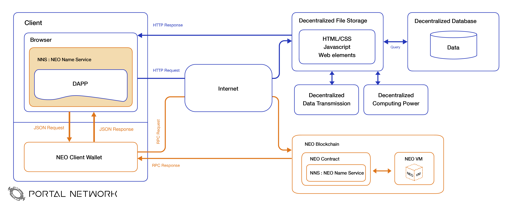

[](https://gitter.im/PortalNetwork/nns?utm_source=badge&utm_medium=badge&utm_campaign=pr-badge&utm_content=badge)

> 📗🌐 Documents and implementations for the NEO Name Service.

## What is NEO?
NEO is a non-profit community-driven blockchain project. It utilizes blockchain technology and digital identity to digitize assets and automate the management of digital assets using smart contracts. Using a distributed network, it aims to create a "Smart Economy".

## What is BNS?
BNS – or blockchain name system – is the protocol on the internet that turns human-comprehensible decentralized website names such as ‘website.perl’ or ‘mywebsite.eth’ into addresses understandable by decentralized network machines.

## 📝 Description

NNS is the NEO Name Service, a distributed, open, and extensible naming system based on the NEO blockchain.

## 📚 Documents

#### Table of Contents
-  [Introduction](./docs/INTRODUCTION.md)
-  [Implementation](./docs/IMPLEMENTATION.md)
    - [Registry](./docs/REGISTRY.md)
    - [Registrar](./docs/REGISTRAR.md)
    - [Resolver](./docs/RESOLVER.md)
-  [Developer Guide](./nns/README.md)
-  [Integration](./docs/INTEGRATION.md)

## Smart Contract Language
- Python
- C#
- Java

## 📍 NNS in Web3.0
NNS plays an connecting and entry layer in Web3.0 services. It connects with NEO wallet, blockchain server, decentralized content resources, and decentralized database.


# NEO Smart Contract Development

#### Smart Contract of NNS
- [.NET](./nns/dotnet/)
- [Python](./nns/python/)

## Prerequisites
- `Docker` installed, download [HERE](https://download.docker.com/mac/stable/Docker.dmg).

## Build using docker
1. Execute command to start docker.
```
docker run -d --name neo-privnet-with-gas -p 20333-20336:20333-20336/tcp -p 30333-30336:30333-30336/tcp -v "$(pwd)":/opt/neo-python/smartContracts metachris/neo-privnet-with-gas
```

2. Start NEO private net through docker
```
docker exec -it neo-privnet-with-gas /bin/bash
```  


3. Run NEO private net
```
python3 /opt/neo-python/prompt.py -c protocol.privnet.json
``` 


4. Create wallet (i.e. portalnetwork.wallet)
```
neo> create wallet portalnetwork.wallet
```


5. At this moment, `portalnetwork.wallet` has no NEO and GAS.   
But you can also run this command to import NEO and GAS.  
```
neo> import wif KxDgvEKzgSBPPfuVfw67oPQBSjidEiqTHURKSDL1R7yGaGYAeYnr
neo> wallet rebuild
neo> wallet
```


6. Exit NEO private net and go to your NEO smart contract project folder.   
Copy your smart contract files to NEO's private net container.
```
docker cp domain.py [container id]:/opt/neo-python/contract/domain.py
```

7. Back into docker, use `neo-boa` build python to avm. run `python3` and execute two command
```
from boa.compiler import Compiler
Compiler.load_and_save('one.py')
``` 


8. Execute NEO private net 
```
python3 /opt/neo-python/prompt.py -c protocol.privnet.json
```

9. Before deploy contract, you should open the wallet. 
```
open wallet portalnetwork.wallet
```

10. Now you can deploy contract 
```
neo> import contract ./contract/domain.avm "" 01 False False
```


11. Search the contract
```
neo> contract search [your contract name]
```

12. Test and invoke contract via the command below
```
neo> testinvoke 68ebfc4fefbe24c9cff0f7e3c0d27ed396d07f9f
```


## 🔗 Resources
- [Official website](https://neo.org/)
- [NEO Documentation](http://docs.neo.org/en-us/index.html)

## 📣 Contributing
See [CONTRIBUTING.md](./CONTRIBUTING.md) for how to help out.

## 🗒 Licence
See [LICENSE](./LICENSE) for details.
